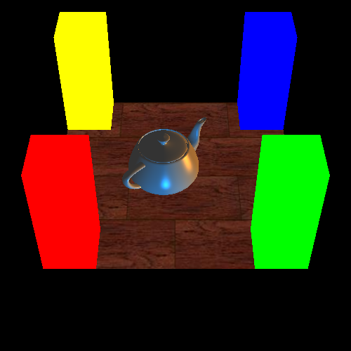
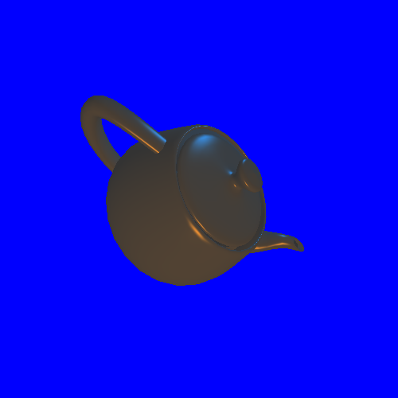
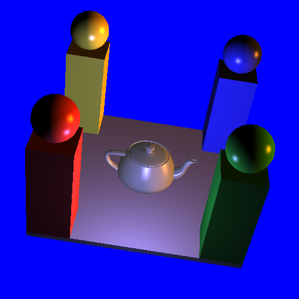

# CS184-CG
Homework of Introduction to Computer Graphics
## HW0 Basic OpenGL
- Sample   

## HW1 Transforming
- Implementation
  - gluLookAt
  - Rotation/Translation/Scaling
- Sample  

## HW2 Rendering
- Implementation
  - Stack maintenance
  - Blinn-Phong model
- Sample  
